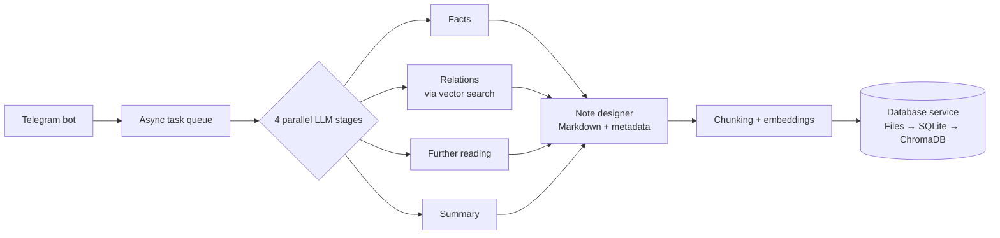

# Knowlage_Base

> 🚧 **Work in Progress** — under active development. Only the text-input path works end to end; APIs, storage layout and setup steps may change.

## About

Capturing something interesting and getting it *saved, structured and linked* to what you already know takes enough effort that most of it is lost. This project removes that friction: you send content to a Telegram bot, and a pipeline turns it into an Obsidian-compatible Markdown note (title, summary, tags, entities, verbatim facts, typed links to related notes, semantic embeddings) and stores it in a knowledge base.

The core idea is that the system **generalizes** knowledge instead of archiving sources, and keeps two layers separate: humans get plain Markdown files, folders and links, while search/RAG relies on embeddings and metadata rather than on where a file lives. The target is a base that scales to hundreds of thousands, and potentially millions, of notes without degrading. The planned input types are text, voice, links, PDFs, images and YouTube/TikTok videos; **at the moment only text is implemented**.

### Implemented pipeline



The database service writes each note in a saga-style transaction (a write-ahead log plus compensating rollback across the three stores) under a per-user lock.

## Tech Stack

- **Language:** Python 3.10
- **Interface:** aiogram (Telegram bot), or an alternative terminal (CLI) entry point for using the bot without Telegram
- **LLM:** DeepSeek via the OpenAI-compatible SDK, with JSON output validated by Pydantic and `tenacity` retries
- **Embeddings:** sentence-transformers (`paraphrase-multilingual-MiniLM-L12-v2`), PyTorch
- **Storage service:** FastAPI + Uvicorn
  - Markdown files with YAML frontmatter (Obsidian-compatible)
  - SQLite (WAL mode) as the metadata index
  - ChromaDB as the vector store (one collection per user)
- **Shared code:** internal packages `kb_schemas` (Pydantic models) and `logger`; pydantic-settings for configuration; httpx for service-to-service calls
- **Infrastructure:** Docker and Docker Compose (dev and prod files; currently being repaired, see below)

## Current Status

**Working (text input only)**

- [x] Telegram bot intake with an in-memory async task queue (3 workers)
- [x] Alternative entry point (`telegram_logic/commands.py`): work with the bot from the terminal when Telegram is unavailable or not wanted
- [x] Parallel 4-stage LLM pipeline (facts, relations, further reading, summary) with per-stage timeouts
- [x] Related-note discovery through vector search over the user's existing notes
- [x] LLM note designer producing Obsidian-style Markdown with frontmatter (tags, entities, relations)
- [x] Chunking and multilingual embeddings
- [x] Storage service with transactional writes across files, SQLite and ChromaDB (WAL, rollback, per-user lock)
- [x] Structured logging, shared schema package

**In progress: stabilization**

- [ ] Fix Docker Compose setup (compose file structure, volume paths, missing dependencies in images)
- [ ] Pipeline error handling: required vs. optional stages, typed errors, LLM client timeouts and retries
- [ ] Data-integrity hardening: collision-safe file names and chunk IDs, path sanitization, WAL-based recovery
- [ ] Automated tests (unit tests plus a pipeline integration test with a mocked LLM)

_All remaining stabilization tasks are listed in [BACKLOG.md](BACKLOG.md)._

**Planned: input types**

- [ ] Voice/audio (speech-to-text)
- [ ] PDF and images (OCR / vision-to-text)
- [ ] Links (page parsing with SSRF protection)
- [ ] YouTube/TikTok transcription
- [ ] Attachment store (content-addressed by hash, outside git)

**Planned: knowledge base**

- [ ] Confidence-based categorization with an `_inbox/_unsorted/` fallback
- [ ] RAG / search endpoint (`/ask`, `/search`)
- [ ] Git-backed vault with versioning and sync
- [ ] Periodic restructuring: MOC/hub notes, merge/split, moving notes

_All remaining knowledge-base tasks are listed in [BACKLOG.md](BACKLOG.md)._

The full audit with priorities and estimates is in [BACKLOG.md](BACKLOG.md).

## Getting Started

**Prerequisites:** Python 3.10+, a Telegram bot token ([@BotFather](https://t.me/BotFather)) and a DeepSeek API key. The first run downloads the embedding model from Hugging Face.

> The Docker Compose files are not usable yet (see the backlog), so the steps below run both services locally. On Windows, activate the virtualenv with `.venv\Scripts\activate`.

**1. Clone the repository**

```bash
git clone <repo-url>
cd <repo-name>
```

**2. Start the storage service** (listens on port 5432, which is the bot's default target)

```bash
cd database
python -m venv .venv && source .venv/bin/activate
pip install -r requirements.txt -e ../packages/logger
uvicorn server:app --port 5432
```

**3. Install dependencies and configure the bot** (in a second terminal)

```bash
cd telegram_logic
python -m venv .venv && source .venv/bin/activate
pip install -r requirements.txt -e ../packages/logger
pip install tenacity apscheduler sqlalchemy   # imported in code but missing from requirements.txt (see BACKLOG.md)

cat > .env <<'EOF'
TELEGRAM_API_TOKEN=<your-telegram-bot-token>
DEEPSEEK_API_KEY=<your-deepseek-api-key>
EOF
```

The database location can be overridden with `DB__HOST` and `DB__PORT` in `.env`.

**4. Run the bot**

Pick one of the two entry points (both use the same pipeline):

- **Telegram** — start the bot and send a text message to it:

  ```bash
  python bot.py
  ```

- **Terminal** — if you can't or don't want to use Telegram, work with the bot from the command line via `commands.py`. Pass the text directly or point to a `.txt` file (`--user-id` is optional):

  ```bash
  python commands.py --text "Your note text here"
  python commands.py --file notes.txt
  ```

  The Telegram token is not used in this mode, but the settings still require the variable, so any placeholder value works.

The generated note appears under `database/data/files/<user_id>/<category>/`.